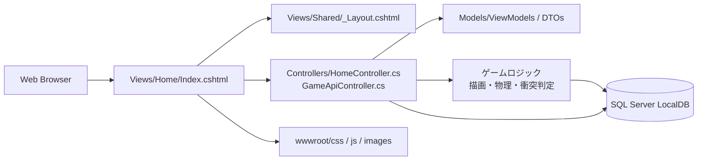

# 詳細システム設計書 / 実装仕様書

## 第1章:システム全体アーキテクチャ

### 1.1 単一 ASP.NET Core MVC プロジェクト構成

| 領域 | 責務 |
|---|---|
| MVC アプリ本体 | 画面表示、API、ゲームロジック、永続化を 1 つの ASP.NET Core プロジェクトで管理する |
| Controllers | `HomeController` や `GameApiController` で画面と API を担当する |
| Models | ViewModel、DTO、保存用のデータ契約を定義する |
| Views | Razor の `cshtml` で HTML/CSS/JS の読み込みと画面構成を定義する |
| wwwroot | `css`、`js`、`images` などの静的アセットを保持する |
| データベース(EF Core + SQL Server LocalDB) | `Worlds` / `Chunks` / `InventoryItems` テーブルによる永続化 |

ゲームロジック、画面表示、API、永続化の責務は同一アプリ内で分離し、別プロジェクトの `Client/` と `Server/` を持たない。画面は Razor の `Views` で、API は `Controllers` で実装する。プレイヤー状態(位置・視点・体力・インベントリ・選択中ホットバー・初期スポーン地点)とチャンクの変更差分は、同一の保存処理でまとめて永続化し、状態の不整合が生じないようにする。

### 1.2 システム構成図



---

## 第2章:フロントエンド設計(TypeScript / Babylon.js)

### 2.1 ボクセルデータ構造 & チャンク管理

- チャンクサイズは **16×256×16** に統一する(Y軸は世界高さ全体を1チャンクで管理する)。
- ブロックIDはフラット配列(`Uint8Array`、長さ 16×256×16)で保持し、インデックスは `index = x + z * 16 + y * 16 * 16` として算出する。
- ブロックIDと属性の対応は以下の通り。

| ID | ブロック名 | 衝突判定 | 破壊可否 / 必要な道具 | ドロップ |
|---|---|---|---|---|
| 0 | 空気 | なし | - | - |
| 1 | 土 | あり | 素手可(0.5秒) | 土 |
| 2 | 草(草ブロック) | あり | 素手可(0.5秒) | 土 |
| 3 | 石 | あり | 木のツルハシ必須(1秒) | 丸石 |
| 4 | 丸石 | あり | 木のツルハシ必須(1秒) | 丸石 |
| 5 | 原木 | あり | 素手可(0.5秒) | 原木 |
| 6 | 木材 | あり | 素手可(0.5秒) | 木材 |
| 7 | 葉 | あり | 素手可(0.5秒) | 葉(低確率) |
| 8 | 水 | **なし(非衝突)** | 破壊不可 | - |
| 9 | 砂 | あり | 素手可(0.5秒) | 砂 |
| 10 | 作業台 | あり | 素手可(0.5秒) | 作業台 |

- 水(ID: 8)は流動・採取・設置・水中移動を持たない非衝突の景観ブロックとして扱う。プレイヤーが水ブロックの領域に重なっても、衝突判定は発生させず、体力・移動速度への影響も与えない。

```typescript
interface IBlockType {
    id: number;
    name: string;
    isCollidable: boolean;      // 衝突判定の有無(水のみ false)
    isBreakable: boolean;       // 破壊可否(水のみ false)
    requiredTool: "none" | "woodenPickaxe";
    breakTimeSeconds: number;   // 0.5 または 1.0
    dropBlockId: number | null;
}
```

### 2.2 描画最適化(メッシュ生成)

- **不可視面のカリング(Face Culling)**: 各ブロックの6面のうち、隣接するブロックが不透明(空気・水以外)である面はメッシュ生成の対象から除外する。水(ID: 8)は非衝突かつ半透明のため、水に隣接する面は通常ブロックと同様にカリング判定の対象とする。
- **テクスチャアトラス(UVマッピング)**: 全ブロック種のテクスチャを1枚のアトラス画像にまとめ、ブロックIDごとにUV座標のオフセットを算出して割り当てる。
- **Web Worker によるバックグラウンドメッシュ生成**: チャンクの頂点・インデックスデータの生成処理をメインスレッドから切り離し、Web Worker上で実行することでメインスレッドのフレームレートを維持する。生成結果は `Transferable` な `ArrayBuffer` としてメインスレッドへ転送する。

### 2.3 プレイヤー操作 & 物理演算

- **カメラ制御**: Babylon.js の `UniversalCamera`(または `FreeCamera`)を用いたFPS視点を実装する。
- **重力・ジャンプ処理**: 常時下方向の加速度を適用し、Spaceキー入力時に上方向の初速を与える。
- **衝突判定**: プレイヤーの当たり判定をAABB(Axis-Aligned Bounding Box)として表現し、ボクセルグリッドとの簡易衝突判定を行う。水ブロック(ID: 8)は `isCollidable = false` のため、この判定から除外する。
- **体力・落下ダメージ**:
  - 体力は最大10ポイントとし、常にHUD上に表示する。
  - 4ブロック以上の高さから落下した場合、4ブロック目を超えた分の1ブロックごとに1ポイントの落下ダメージを与える(例: 6ブロック落下 → 2ポイントのダメージ)。
  - ダメージを受けてから10秒間、追加ダメージがなければ、以後10秒ごとに体力を1ポイント自然回復する。
  - 体力が0になった場合、プレイヤーは初期スポーン地点で体力10ポイントの状態として復活する。復活時もインベントリの内容と選択中のホットバースロットは保持する。

```typescript
interface IPlayerState {
    position: { x: number; y: number; z: number };
    rotation: { yaw: number; pitch: number };
    health: number;                 // 0〜10
    selectedHotbarSlot: number;      // 0〜8
    spawnPosition: { x: number; y: number; z: number };
    inventory: IInventorySlot[];     // 長さ36(メイン27 + ホットバー9)
}

interface IInventorySlot {
    slotIndex: number;   // 0〜35(0〜26: メイン, 27〜35: ホットバー)
    blockOrItemId: number | null;
    quantity: number;    // ブロック類は最大64、道具類は最大1
}
```

### 2.4 ブロックインタラクション

- **レイキャスト**: プレイヤーの視点方向へボクセル単位のレイマーチングを行い、最初に衝突する不透明ブロック(水を除く)とその隣接面を検出する。
- **破壊・設置**:
  - マウス左クリックを長押しすると、対象ブロックの `breakTimeSeconds` に応じた時間経過後にブロックを削除し、`dropBlockId` に応じたアイテムをインベントリへ追加する。
  - 石(ID: 3)は `requiredTool` が `woodenPickaxe` であるため、木のツルハシを選択中のホットバースロットに所持していない場合は破壊処理自体を開始しない。
  - マウス右クリックで、レイキャストが検出した面に隣接する位置へ、選択中のホットバーのブロックを設置する。
  - ブロックの破壊・設置に伴い、対象チャンクおよび隣接チャンクのメッシュを再構築する。
- **道具の耐久値**: MVPでは道具の耐久値を実装しない。木のツルハシは使用回数にかかわらず破壊可否・破壊時間を変化させず、消耗によって壊れることもない。

### 2.5 プロシージャル地形生成

- パーリンノイズを用いて地表高を決定し、チャンクごとに地形生成を行う。
- 頻度と振幅のパラメータを `octaves`、`scale`、`persistence`、`lacunarity` として定義し、シード値は `World.Seed` から一貫して導出する。
- 初期設定として `octaves=4`, `scale=1/64`, `persistence=0.5`, `lacunarity=2.0` を採用する。
- 地形生成はサーバー側ロジックが責務を持ち、ブラウザ側は取得済みチャンクの描画とローカルキャッシュ更新に専念する。

---

## 第3章:バックエンド設計(ASP.NET Core MVC + API)

### 3.1 APIエンドポイント仕様

| エンドポイント | 概要 |
|---|---|
| `POST /api/worlds` | 新規ワールド作成・シード値生成 |
| `GET /api/worlds/{id}` | ワールド情報・プレイヤー位置・インベントリ取得 |
| `POST /api/worlds/{id}/chunks` | 変更・生成されたチャンクのバッチ保存 |
| `GET /api/worlds/{id}/chunks?x={x}&y={y}&z={z}` | 特定チャンクの取得 |
| `PUT /api/worlds/{id}/state` | プレイヤー位置・視点・インベントリ・選択中ホットバー・体力・初期スポーン地点と、変更済みチャンクを同一時点の内容として保存 |

- 各エンドポイントは、リソースが存在しない場合は404、バリデーションエラーは400、サーバーエラーは500を返し、RFC 7807 ProblemDetails形式でエラーレスポンスを返す。
- クライアントは30秒ごと、およびワールド選択画面へ戻る前に `PUT /api/worlds/{id}/state` を呼び出してプレイヤー状態と変更済みチャンクを保存する。保存が完了するまで、別ワールドへの切替操作を行わない。

### 3.2 チャンクデータ転送仕様

- 転送量削減のため、チャンクのブロックデータはバイナリストリームまたは圧縮JSON(GZip / Brotli)で送受信する。

---

## 第4章:データベース設計 & 永続化(EF Core + SQL Server LocalDB)

### 4.1 テーブル定義 / ER設計

**`Worlds`**

| カラム | 型 | 説明 |
|---|---|---|
| WorldId | Guid (PK) | ワールドの識別子 |
| Name | nvarchar | ワールド名 |
| Seed | int | 地形生成シード値 |
| CreatedAt | datetime2 | 作成日時 |
| PlayerPosX / PlayerPosY / PlayerPosZ | float | プレイヤー位置 |
| Yaw / Pitch | float | 視点の向き |
| CurrentHealth | int | 現在の体力(0〜10) |
| SelectedHotbarSlot | int | 選択中のホットバースロット(0〜8) |
| SpawnPosX / SpawnPosY / SpawnPosZ | float | 初期スポーン地点 |

**`Chunks`**

| カラム | 型 | 説明 |
|---|---|---|
| ChunkId | Guid (PK) | チャンクの識別子 |
| WorldId | Guid (FK) | 所属するワールド |
| ChunkX / ChunkY / ChunkZ | int | チャンク座標 |
| BlockData | varbinary(max) | 変更済みブロックの圧縮データ |
| LastModified | datetime2 | 最終更新日時 |

**`InventoryItems`**

| カラム | 型 | 説明 |
|---|---|---|
| InventoryItemId | Guid (PK) | インベントリ項目の識別子 |
| WorldId | Guid (FK) | 所属するワールド |
| SlotIndex | int | スロット番号(0〜35。0〜26: メイン、27〜35: ホットバー) |
| BlockOrItemId | int | ブロック/アイテムID |
| Quantity | int | 個数(ブロック類は最大64、道具類は最大1) |

1ワールドにつきメインインベントリ27スロットとホットバー9スロットからなる合計36スロットを、`InventoryItems` テーブルの `SlotIndex` によって復元する。

### 4.2 チャンク保存戦略

- 未編集チャンク(シード値から再生成可能)は保存せず、**プレイヤーが変更を加えたチャンクのみをバイナリ圧縮して永続化**する。
- プレイヤー状態(`Worlds` テーブル)と変更済みチャンク(`Chunks` テーブル)は、`PUT /api/worlds/{id}/state` の1回のトランザクション内でまとめて更新し、一方だけが更新されて状態が矛盾することを防ぐ。

### 4.3 EF Core エンティティ & DbContext 定義例

```csharp
public class World
{
    public Guid WorldId { get; set; }
    public string Name { get; set; } = string.Empty;
    public int Seed { get; set; }
    public DateTime CreatedAt { get; set; }
    public float PlayerPosX { get; set; }
    public float PlayerPosY { get; set; }
    public float PlayerPosZ { get; set; }
    public float Yaw { get; set; }
    public float Pitch { get; set; }
    public int CurrentHealth { get; set; }
    public int SelectedHotbarSlot { get; set; }
    public float SpawnPosX { get; set; }
    public float SpawnPosY { get; set; }
    public float SpawnPosZ { get; set; }

    public List<Chunk> Chunks { get; set; } = new();
    public List<InventoryItem> InventoryItems { get; set; } = new();
}

public class Chunk
{
    public Guid ChunkId { get; set; }
    public Guid WorldId { get; set; }
    public int ChunkX { get; set; }
    public int ChunkY { get; set; }
    public int ChunkZ { get; set; }
    public byte[] BlockData { get; set; } = Array.Empty<byte>();
    public DateTime LastModified { get; set; }
}

public class InventoryItem
{
    public Guid InventoryItemId { get; set; }
    public Guid WorldId { get; set; }
    public int SlotIndex { get; set; }
    public int BlockOrItemId { get; set; }
    public int Quantity { get; set; }
}

public class GameDbContext : DbContext
{
    public GameDbContext(DbContextOptions<GameDbContext> options) : base(options) { }

    public DbSet<World> Worlds => Set<World>();
    public DbSet<Chunk> Chunks => Set<Chunk>();
    public DbSet<InventoryItem> InventoryItems => Set<InventoryItem>();

    protected override void OnModelCreating(ModelBuilder modelBuilder)
    {
        modelBuilder.Entity<World>()
            .HasMany(w => w.Chunks)
            .WithOne()
            .HasForeignKey(c => c.WorldId);

        modelBuilder.Entity<World>()
            .HasMany(w => w.InventoryItems)
            .WithOne()
            .HasForeignKey(i => i.WorldId);

        modelBuilder.Entity<Chunk>()
            .HasIndex(c => new { c.WorldId, c.ChunkX, c.ChunkY, c.ChunkZ })
            .IsUnique();

        modelBuilder.Entity<InventoryItem>()
            .HasIndex(i => new { i.WorldId, i.SlotIndex })
            .IsUnique();
    }
}
```

---

## 第5章:TypeScript / C# インターフェース設計

### 5.1 TypeScript 側

```typescript
interface IChunk {
    x: number;
    y: number;
    z: number;
    blocks: Uint8Array; // 長さ 16 * 256 * 16
}

interface IVoxelWorld {
    worldId: string;
    seed: number;
    chunks: Map<string, IChunk>; // key: `${x},${y},${z}`
}

interface IBlockType {
    id: number;
    name: string;
    isCollidable: boolean;
    isBreakable: boolean;
    requiredTool: "none" | "woodenPickaxe";
    breakTimeSeconds: number;
    dropBlockId: number | null;
}

interface IPlayerState {
    position: { x: number; y: number; z: number };
    rotation: { yaw: number; pitch: number };
    health: number;
    selectedHotbarSlot: number;
    spawnPosition: { x: number; y: number; z: number };
    inventory: IInventorySlot[]; // 長さ36
}

interface IInventorySlot {
    slotIndex: number;
    blockOrItemId: number | null;
    quantity: number;
}
```

### 5.2 C# 側

```csharp
public class ChunkSaveRequestDto
{
    public int ChunkX { get; set; }
    public int ChunkY { get; set; }
    public int ChunkZ { get; set; }
    public byte[] BlockData { get; set; } = Array.Empty<byte>();
}

public class WorldDetailResponseDto
{
    public Guid WorldId { get; set; }
    public string Name { get; set; } = string.Empty;
    public int Seed { get; set; }
    public PlayerStateDto PlayerState { get; set; } = new();
}

public class WorldStateSaveRequestDto
{
    public PlayerStateDto PlayerState { get; set; } = new();
    public List<ChunkSaveRequestDto> ModifiedChunks { get; set; } = new();
}

public class PlayerStateDto
{
    public float PosX { get; set; }
    public float PosY { get; set; }
    public float PosZ { get; set; }
    public float Yaw { get; set; }
    public float Pitch { get; set; }
    public int Health { get; set; }
    public int SelectedHotbarSlot { get; set; }
    public float SpawnPosX { get; set; }
    public float SpawnPosY { get; set; }
    public float SpawnPosZ { get; set; }
    public List<InventorySlotDto> Inventory { get; set; } = new();
}

public class InventorySlotDto
{
    public int SlotIndex { get; set; }
    public int? BlockOrItemId { get; set; }
    public int Quantity { get; set; }
}
```

---

## 第6章:開発ロードマップ

実装順序と各ステップの完了条件・依存関係は `Plans/ゲーム実装計画.Ver1.md` を正とする。本章では個別のステップ番号を重複定義せず、同ドキュメントに従う。
